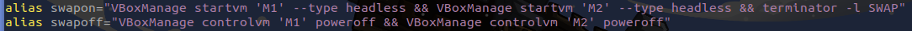
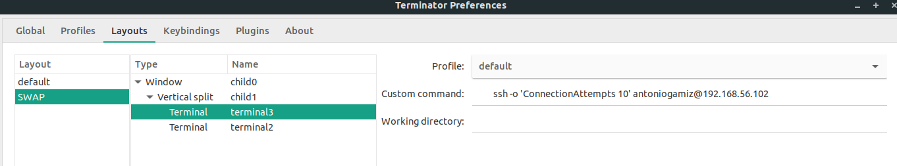

## Configuración prácticas VirtualBox y SSH

Para hacer el setup del entorno de trabajo rápidamente:

## Información útil

- Profesor: José Manuel Soto Hidalgo
- Apuntes tema 1 : http://bit.ly/SWAP-Tema1

## Links

- Iniciar Virtual Box desde un script [link](https://www.techrepublic.com/article/how-to-create-a-bash-script-for-starting-virtualbox-vms/).

## Kahoots SWAP

### Kahoot 1

1. Una granja web es un conjunto de servidores dedicados a servir contenido web a usuarios finales:

- [ ] Verdadero
- [x] Falso

2. Los modelos de servicio básicos del concepto `cloud computing` son:

- [x] saas paas iaas
- [ ] faas paas iaas
- [ ] saas paas
- [ ] daas saas caas iaas

3. ¿Qué es un `cold spare server`?

- [ ] Servidor para pruebas software
- [ ] Servidor de refrigseración
- [ ] Servidor de repuesto
- [x] Servidor replicado para uso en caso de que falle el principal

4. La arquitectura más adecuada para montar una granja web es:

- [ ] Sistema aislado
- [ ] Cliente-cola-cliente
- [ ] Cliente-servidor
- [x] Arquitectura n-capas

5. Con virtualización se puede:

- [ ] Aumentar los recursos hardware
- [x] Hacer uso eficiente de los recursos hardware
- [ ] Reducir los tiempos de acceso y cómputo
- [ ] Utilizar distintos hardware en la misma máquina

6. El modelo cloud proporciona:

- [x] Acceso por demanada a un conjunto compartido de recursos
- [ ] Servicios informáticos de bajo coste
- [ ] Acceso privado a recursos informáticos
- [ ] Software a través de Internet

7. El modelo cloud proporciona servicios de forma estática y robusta:

- [ ] Verdadero
- [x] Falso

aspectos de las greenit para reduccion del consumo de un cpd son

- [ ] Reducción de la capacidad de cómputo de los servidores
- [ ] Utilización estática de recursos a baja potencia
- [ ] Reducción de la temperatura de la sala de servidores
- [x] Virtualización y utilización dinámica de recursos

si el hardware y software comienzan a dar fallos tendremos un problema de

- [x] Disponibilidad
- [ ] Viabilidad
- [ ] Carga del sistema
- [ ] Escalabilidad

10. La escalabilidad es la capacidad de:

- [ ] Mejorar un servidor
- [ ] Aceptar un número determinado de peticiones
- [ ] Procesar una petición web
- [x] Dar soporte a un número creciente de usuarios

11.  La consolidación de servidores es la reestructuración de la infraestructura del cpd:

- [x] Verdadero
- [ ] Falso