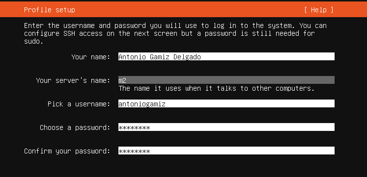

## Preparación de las herramientas

Primeramente nos tenemos que descargar el archivo ISO [Ubuntu server 18.04](https://ubuntu.com/download/server). Una vez descargado el archivo, creamos dos máquinas virtuales a partir de él, llamadas `M1` y `M2`, y seguimos los pasos de la instalación:

Una vez instaladas las máquinas, procedemos a instalar el software necesario:

Comprobamos que `Apache` está funcionando correctamente:

E instalamos el resto de herramientas para `php`:

Añadimos el fichero web de ejemplo y usamos `curl` para ver si todo es correcto:

Por último, comprobamos que podemos conectarnos de una máquina a otra y viceversa:

